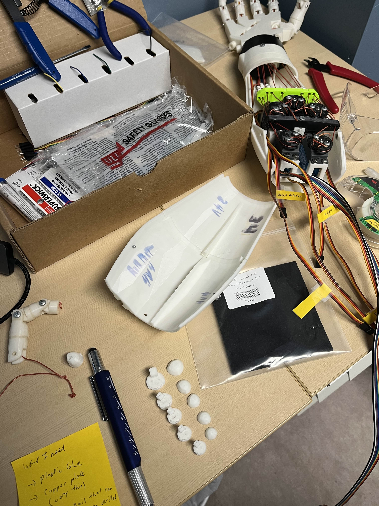

# 🤖 InMoov AI Hand Robotic Project

## 📖 Table of Contents
- [Overview](#-overview)
- [Features](#-features)
- [Components](#-components)
  - [Hardware](#-hardware)
  - [Software](#-software)
- [Circuit Diagram](#-circuit-diagram)
- [Demonstration](#-demonstration)
- [How to Run](#-how-to-run)
- [Future Improvements](#-future-improvements)
- [Acknowledgments](#-acknowledgments)
- [License](#-license)

## 🌟 Overview

This project involves building and programming an **InMoov robotic hand and forearm** controlled by servo motors, utilizing a **Raspberry Pi 4**. The robotic hand mimics human hand movements captured through a **camera** using **OpenCV**. This README provides an overview of the project's progress, functionality, and implementation details.

## 🎥 Final Product Video

🚧 **TODO:** Put video here

## ✨ Features

- 🛠️ **Servo Motor Control:** The robotic hand is powered by servo motors controlled through the PCA9685 driver.
- 📹 **Hand Tracking with OpenCV:** A camera tracks human hand movements, and the robotic hand replicates them in real-time.
- 🐍 **Python-Based Control System:** The entire system is implemented in Python, leveraging libraries like OpenCV, MediaPipe, and Adafruit PCA9685.
- ⚙️ **Flexible and Modular Design:** The project is designed to be adaptable for future improvements, such as adding voice commands or IoT integration.

## 🧩 Components

### 🛒 Hardware

- 🖥️ **Raspberry Pi 4**: The central processing unit for controlling the robotic hand.
- 🔋 **5V 30A 150W Power Supply**: Provides power to the PCA9685 driver and five servo motors, ensuring stable and sufficient current for operation.
- 🧩 **PCA9685 Driver**: Controls up to 16 PWM signals for the servo motors.
- 💪 **HK-15298 Servo Motors**: Five motors to control the fingers.
- 📷 **Raspberry Pi HQ Camera**: Used to track hand movements.

### 💻 Software

- 🖼️ **OpenCV**: For hand tracking and gesture recognition.
- 📦 **Adafruit PCA9685 Library**: For interfacing with the servo motor driver.
- 🐍 **Python**: The primary programming language for the project.

## 🔌 Circuit Diagram


## 📸 Demonstration

### 🖼️ Images





### 🛠️ For more images and videos of the project's development and my debugging story with hardware/software 🤯, [click here!](images/README.md).

## 🚀 How to Run

1. 🛠️ **Build Robotic Arm:**
   - You will need to 3D print the parts for the robotic hand and forearm. Follow the steps in the [InMoov Project](https://inmoov.fr/hand-and-forarm/) to assemble the robotic hand.
2. 🖥️ **Set up Raspberry Pi:**
   - Have an SD card with Raspberry Pi OS installed with SSH enabled (I advise using more than 16GB SD card).
   - Install Python, OpenCV, Adafruit libraries.
   - Enable I2C on the Raspberry Pi.
3. ⚡ **Set up hardware:**
   - Power the PCA9685 driver with the 5V power supply with a minimum 20A current.
   - Connect the PCA9685 driver to the Raspberry Pi and the servo motors from the robotic arm.
   - Connect the camera to the Raspberry Pi.
4. 🔄 **Test your servos:**
   - This will help you understand the range of motion of your servos and how to control them so that you can adjust the code accordingly to calibrate the servos.
   ```bash
   python hand_servo_motor_test.py
   ```
5. ▶️ **Run the main script:**
    - Run the main script to start the hand tracking and control the robotic hand.
    ```bash
    python hand_tracking.py
    ``` 

## 🚧 Future Improvements

- 🎛️ **Haptic Feedback:** Add feedback to gloves and make it control the robotic hand.
- 🌐 **IoT Integration:** Control the hand remotely via the internet.
- 🎙️ **Voice Commands:** Integrate speech recognition for combined voice and gesture control. (Maybe even have a rock-paper-scissors game!)

## 🙌 Acknowledgments

Special thanks to the members of the [InMoov Discord Server](https://discord.gg/FKJ6GSEwHr) for their invaluable guidance and support throughout the project. Especially to hairygael, the admin of the server and the creator of the InMoov project.

## 📜 License

This project is licensed under the MIT License. See the LICENSE file for details.

Let me know if you’d like more changes! 🚀