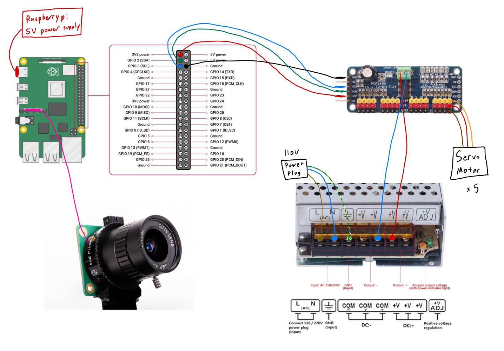

# 🤖 InMoov Hand Gesture Recognition with FPGA Acceleration

A personal hardware-software project to control an InMoov robotic hand using real-time hand gesture recognition powered by a Convolutional Neural Network (CNN) and FPGA-based acceleration. The goal is to transition from software inference to a fully hardware-accelerated AI pipeline on the DE1-SoC board.

---

## 📌 Project Goal

Use a USB webcam to capture hand gestures, recognize them with a trained CNN, run inference on the DE1-SoC ARM processor, and eventually accelerate the CNN on the FPGA using Verilog or HLS. The result controls a robotic InMoov hand in real time using the PCA9685 PWM driver.

---

## 🔌 Circuit Diagram

## 📁 Branching Structure

Each task is being developed in its own branch:
- `task-2`: Image data collection
- `task-3`: CNN model training
- `task-4`: TFLite model conversion
- `task-5`: Raspberry Pi inference
- `task-6`: ARM inference + PCA9685 I2C control
- `task-7`: FPGA control logic via memory-mapped I/O
- `task-8`: CNN layer acceleration in hardware
- `task-9`: Full CNN implementation in hardware

The `main` branch will always reflect the **most up-to-date merged progress** from all task branches.

---

## ✅ Project Checklist

### 👋 Hardware Setup
- [✅] **Task 1 – Create the robot arm based on InMoov hand and forearm Open source site**  
  Built and tested robotic hand with servo motors. Control currently works via Python script and PWM.

---

### 📸 Software Tasks
- [ ] **Task 2 – Capture gesture images with USB WebCam on Raspberry Pi 4**  
  Use OpenCV on Raspberry Pi to collect training images for different hand gestures. Store in class-labeled folders.

- [ ] **Task 3 – Train CNN using Keras + TensorFlow**  
  Train a CNN model to recognize the gestures using your custom dataset. Save model as `.h5` or `.pb`.

- [ ] **Task 4 – Convert model to TFLite**  
  Optimize trained model using TensorFlow Lite for embedded inference. Output `.tflite` file for deployment.

- [ ] **Task 5 – Run model on Raspberry Pi and get working predictions**  
  Use TFLite interpreter to load the model and run real-time inference using webcam input.

- [ ] **Task 6 – Run model on ARM (DE1-SoC) with USB WebCam and connect PCA9685 driver**  
  Use TFLite interpreter on ARM Linux (Cortex-A9) to perform gesture inference. Connect PCA9685 via I2C to drive servo motors based on predictions.

- [ ] **Task 7 – Send prediction result to FPGA and control robotic hand**  
  Use memory-mapped I/O to communicate gesture class from ARM to FPGA. FPGA reads value and generates PWM or forwards it to PCA9685 logic.

---

### 🔧 FPGA Hardware Acceleration
- [ ] **Task 8 – Replace first CNN layer (convolution) with FPGA block**  
  Implement the first convolutional layer in hardware using either Intel HLS or manual Verilog design. Validate against TensorFlow output.

- [ ] **Task 9 – Build full CNN in Verilog or HLS**  
  Fully port the CNN inference pipeline to the FPGA fabric. Feed image data directly to FPGA and output predicted gesture without software involvement.

---

## 📦 Tools & Technologies

- USB Webcam (OpenCV compatible)
- Raspberry Pi + Python
- TensorFlow / Keras / TensorFlow Lite
- Python + OpenCV
- Intel DE1-SoC Board (Cyclone V + ARM Cortex-A9)
- PCA9685 Servo Driver (controlled via I2C)
- Verilog / SystemVerilog (Quartus Prime)
- Intel HLS Compiler (optional)
- mmap / AXI bridge for ARM–FPGA communication
- ModelSim + UVM (optional for simulation/verification)

---

## 📷 Demo (Coming Soon)
- Real-time gesture detection video
- Robot hand mirroring gestures via PCA9685
- FPGA-based CNN acceleration showcase

---

## 📂 Branches Progress Overview

| Task | Branch | Status |
|------|--------|--------|
| Task 2 | `task-2` | In Progress |
| Task 3 | `task-3` | Not Started |
| Task 4 | `task-4` | Not Started |
| Task 5 | `task-5` | Not Started |
| Task 6 | `task-6` | Not Started |
| Task 7 | `task-7` | Not Started |
| Task 8 | `task-8` | Not Started |
| Task 9 | `task-9` | Not Started |

---

## 🚀 Author

**Jason Lee** – Computer Engineering @ UBC  

---

